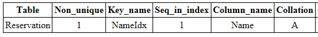
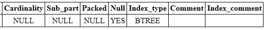
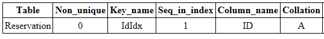
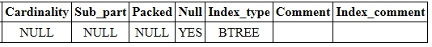
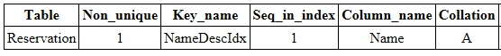
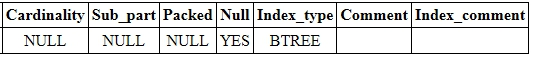

[TOC]


- 오늘 공부했던 것들을 정리하는 레파지토리


# MySQL 쿼리튜닝


https://itseminar.tistory.com/15 참조

## INDEX

### 인덱스란?

- 인덱스(index)는 테이블에서 원하는 데이터를 쉽고 빠르게 찾기 위해 사용합니다.
  이러한 인덱스는 자주 사용되는 필드 값으로 만들어진 원본 테이블의 사본이라고 생각할 수 있습니다.

  MySQL은 데이터를 검색할 때 첫 번째 필드부터 차례대로 테이블 전체를 검색합니다.
  따라서 테이블이 크면 클수록 데이터를 탐색하는 시간도 많이 늘어나게 됩니다.

  하지만 인덱스를 사용하면 테이블 전체를 읽지 않아도 되므로, 검색과 질의에 대한 처리가 빠르게 이루어집니다.
  이러한 인덱스는 사용자가 직접 접근할 수는 없으며, 검색과 질의에 대한 처리에서만 사용됩니다.

  이렇게 인덱스가 설정된 필드 값을 포함한 데이터의 삽입, 삭제, 수정 작업이 원본 테이블에서 이루어질 경우, 인덱스도 함께 수정되어야 합니다.
  따라서 인덱스가 설정된 테이블의 처리 속도가 느려질 수 있습니다.
  그러므로 인덱스는 수정보다는 검색이 자주 사용되는 테이블에서 사용하는 것이 더 좋습니다.

### 인덱스 생성

- CREATE 문을 사용하여 인덱스를 생성할 수 있습니다.

 

- MySQL에서 인덱스를 생성하는 문법은 다음과 같습니다.


- 문법

```mysql
CREATE INDEX 인덱스이름

ON 테이블이름 (필드이름1, 필드이름2, ...)
```


 

- 이때 쉼표(,)를 사용하여 여러 필드를 가지는 인덱스를 생성할 수도 있습니다.

 

- 다음 예제는 Reservation 테이블의 Name 필드에 NameIdx라는 인덱스를 설정하는 예제입니다.


- 예제

```mysql
CREATE INDEX NameIdx

On Reservation (Name);
```


- ##### 실행 결과

  

  


### 인덱스 정보 보기

- 위와 같이 생성한 인덱스는 다음과 같은 문법을 통해 확인할 수 있습니다.


- 문법

```mysql
SHOW INDEX

FROM 테이블이름
```


- 위와 같은 문법을 사용하면 해당 테이블에 생성된 모든 인덱스의 정보를 보여줍니다.

  이때 반환되는 인덱스 정보의 필드 값은 다음과 같습니다.

   

  1. Table : 테이블의 이름을 표시함.
  2. Non_unique : 인덱스가 중복된 값을 저장할 수 있으면 1, 저장할 수 없으면 0을 표시함.
  3. Key_name : 인덱스의 이름을 표시하며, 인덱스가 해당 테이블의 기본 키라면 PRIMARY로 표시함.
  4. Seq_in_index : 인덱스에서의 해당 필드의 순서를 표시함.
  5. Column_name : 해당 필드의 이름을 표시함.
  6. Collation : 인덱스에서 해당 필드가 정렬되는 방법을 표시함.
  7. Cardinality : 인덱스에 저장된 유일한 값들의 수를 표시함.
  8. Sub_part : 인덱스 접두어를 표시함.
  9. Packed : 키가 압축되는(packed) 방법을 표시함.
  10. Null : 해당 필드가 NULL을 저장할 수 있으면 YES를 표시하고, 저장할 수 없으면 ''를 표시함.
  11. Index_type : 인덱스에 사용되는 메소드(method)를 표시함.
  12. Comment : 해당 필드를 설명하는 것이 아닌 인덱스에 관한 기타 정보를 표시함.
  13. Index_comment : 인덱스에 관한 모든 기타 정보를 표시함.


### UNIQUE INDEX 생성

- UNIQUE INDEX는 중복 값을 허용하지 않는 인덱스입니다.

- MySQL에서 UNIQUE INDEX를 생성하는 문법은 다음과 같습니다.


- 문법

```mysql
CREATE UNIQUE INDEX 인덱스이름

ON 테이블이름 (필드이름1, 필드이름2, ...)
```


- 또한, 쉼표(,)를 사용하여 여러 필드에 UNIQUE INDEX를 설정해 줄 수도 있습니다.

- 다음 예제는 Reservation 테이블의 ID 필드에 IdIdx라는 UNIQUE INDEX를 설정하는 예제입니다.


- 예제

```
CREATE UNIQUE INDEX IdIdx

On Reservation (ID);
```


- 실행결과






### 인덱스 정렬

- 인덱스를 생성할 때 인덱스에 포함되는 필드의 정렬 방식을 설정할 수 있습니다.

- DESC 키워드를 사용하면 내림차순으로 정렬되며, ASC 키워드를 사용하면 오름차순으로 정렬됩니다.


- 문법

```
1. CREATE INDEX 인덱스이름

   ON 테이블이름 (필드이름 DESC)

2. CREATE INDEX 인덱스이름

   ON 테이블이름 (필드이름 ASC)
```


- 다음 예제는 Reservation 테이블의 Name 필드에 NameDescIdx라는 인덱스를 설정하는 예제입니다. 이때 Name 필드의 값들은 내림차순으로 정렬됩니다.


- 예제

```
CREATE INDEX NameDescIdx

On Reservation (Name DESC);
```


- 결과






- 보통 쿼리 튜닝 시에 인덱스 여부를 먼저 확인합니다.

  - 인덱스가 제대로 설정이 되어있는지를 확인하고,
  - 그렇지 않다면 인덱스를 추가하거나, 혹은 불필요한 곳에 들어갔을 경우 인덱스를 제거합니다.

  그렇다면 인덱스 시 고려해야 할 점은 무엇일까요?


## 인덱스 시 고려할 점

1. **중복 인덱싱 피하기** : 키로 설정된 곳에 인덱싱 추가하지 않기

2. **인덱스 최소화** : 인덱스 역시 사본 형태로 저장된 데이터라 하드웨어 자원을 소모. 성능 저하 초래

3. **WHERE, ORDER BY, GROUP BY 절에는 인덱스 지정** : 서버 결과를 fetch 하는데 더 빠르게 하는 것을 도와줌 (정렬에도 도움)

4. **인덱스 중복 데이터 확인** : 카운트 비율을 활용해, Index uniqueness 비율을 확인. 평균 90% 이상으로 유지.

   - ```
     SELECT (COUNT(DISTINCT indexed_column)/COUNT(*)) * 100 FROM some_table;
     ```

5. **문자열은 CRC32로 인덱싱** : 회원 아이디, 회원 이메일 등은 CRC32 칼럼으로 SELECT.

   - CRC란? http://wiki.hash.kr/index.php/CRC-32

   - ```
     SELECT * FROM tables
     WHERE email_crc = crc32('seongman@seongman.com') AND email = 'seongman@seongman.com';
     ```


## EXPLAIN

### EXPLAIN이란?

- Explain의 기능은, MySQL 웹페이지에 이렇게 기록되어있다.

  > Obtaining Table Structure Information
  > Obtaining Execution Plan Information
  > Obtaining Information with EXPLAIN ANALYZE

- 테이블 구조 정보 확인
- 쿼리 실행 계획 정보 확인 (최적화에 주로 사용됨)
- 쿼리 실행 분석 정보 확인 (튜닝 시에는 크게 사용되지 않으므로 간단히 설명)


#### 1. 테이블 구조 정보 확인

- EXPLAIN으로 테이블명을 실행하면, 아래와 같이 정보가 나타난다.

  - ```
    EXPLAIN table_name;
    ```

  

| Field        | Type              | Null | Key  | Default | Extra          |
| ------------ | ----------------- | ---- | ---- | ------- | -------------- |
| (1) pk_col   | int(11) unsigned  | NO   | PRI  | (NULL)  | auto_increment |
| (2) int_col  | int(11)           | NO   |      | 0       |                |
| (3) fk_col   | int(11) unsigned  | NO   | MUL  | (NULL)  |                |
| (4) enum_col | enum('A','B','C') | NO   |      | A       |                |
| (5) txt_col  | text              | YES  |      | (NULL)  |                |


- OUTPUT 은 총 6개의 콜럼으로 표시된다. 

  - Field : 필드명 표시
  - Type : 데이터 타입 표시
  - Null : Null 이 가능한지 표시 (YES / NO)
  - Key : INDEX 정보 표시
  - Default : 필드 Default 값 표시
  - Extra : 그 외 정보 

  EXPLAIN table_name 간단한 테이블 구조를 확인할 수 있다.

  

#### 2. 쿼리 실행 계획 정보 확인

- EXPLAIN SELECT 하게 되면 데이터를 추출하는데 어떤 계획으로 데이터를 추출할 예정인지를 표시해준다.

```
EXPLIAN SELECT * FROM table1
	INNER JOIN table2 on table1.pk_no = table2.table1_pk_no
WHERE table1.pk_no < 30 AND table1.index_number LIKE 'Hello world%;
```


| id   | select_type | table  | partitions | type   | possible_keys | key     | key_len | ref    | rows | filtered | extra |
| ---- | ----------- | ------ | ---------- | ------ | ------------- | ------- | ------- | ------ | ---- | -------- | ----- |
| 1    | SIMPLE      | table1 | (NULL)     | range  | PRIMARY, ...  | PRIMARY | 4       | (null) | 971  | 11.11    | ...   |
| 1    | SIMPLE      | table2 | (NULL)     | eq_ref | PRIMARY, ...  | PRIMARY | 4       | ...    | 22   | 100.00   | ...   |

##### 1) "id"

- 실행 순서에 따라 ID 부여 
- 아이디의 수가 같을 경우에는 해당 쿼리가 동시에 실행됨을 의미

##### 2) "select_type"

- 쿼리의 종류를 나눔
- "SIMPLE" : 쿼리 절 내의 다른 쿼리 혹은 union 쿼리가 없을 경우에 표시
- "SUBQUERY" : SELECT 구문에서 나타나는 쿼리 절이 있을 경우에 표시
- "DERIVED" : FROM 구문에 나타나는 쿼리절이 있을 경우에 표시
- "UNION" : UNION을 사용한 쿼리가 있을 경우에 표시
- "UNION_RESULT" : UNION 임시 테이블을 사용할 경우에 표시

##### 3) "table"

- 어떤 테이블을 사용 혹은 접근하는지를 표시
- 테이블 명, drived(Number) , union가 표시

| 설명용 | id   | select_type | table      | partitions | type |
| ------ | ---- | ----------- | ---------- | ---------- | ---- |
| ROW1   | 1    | PRIMARY     | derived2   | ..         | ..   |
| ROW2   | 2    | DERIVED     | derived3   | ..         | ..   |
| ROW3   | 3    | DERIVED     | table_name | ..         | ..   |

- (테이블 설명) **[ROW1]의** table 란에 표시된, derived2는, 다음 ROW2를 참조
- (테이블 설명) **[ROW2]의** **select_type** : *DERIVED*, **id** : 2 == > *derived2*
- (테이블 설명) **[ROW2]의** table 란에 표시된, derived3는, 다음 ROW3를 참조
- (테이블 설명) **[ROW3]의** **select_type** : *DERIVED*, **id** : 3 == > *derived3*
- (테이블 설명) **[ROW3]**의 **select_type** : *DERIVED*, table : *table_name*.  table_name이라는 테이블을 참조함을 알 수 있음

##### 4) "type"

- coulmn search (filter) 방식을 표시
- (1) ALL > (2) INDEX > (3) RANGE > (4) ref > (5) eq_ref > (6) const 순으로 색출이 빠름
- (1) ALL : 검색을 하기 위해 모든 데이터를 읽고 색출함
- (2) INDEX : 인덱스 순서로 모든 데이터를 읽고 색출함 => ALL과 동일하나, INDEX만 기록된 데이터 내에서 데이터를 읽고 색출함
- (3) RANGE : =, <, >, ISNULL, <=>, BETWEEN, IN 등 일정 범위 내에 있는 값을 읽고 색출함.
- (4) ref : =, < , > 연산자를 사용하여 인덱스 내에 색출됨을 표시. 다만 인덱스가 PRIMARY, UNIQUE 가 아닐 때 적용.
- (5) eq_ref : = 연산자를 사용하여 인덱스 내에 색출됨을 표시. PRIMARY KEY, UNIQUE 연산일 때 일반적으로 적용.
- (6) const : PRIMARY KEY , UNIQUE 인덱스가 걸려있는 모든 부분을 상수값으로 색출할 때 적용

##### 5) "possible_keys"

- 색출할 때, 사용할 수 있는 모든 인덱스 값을 나열함
- NULL 일 경우, 해당 쿼리를 실행할 때, 사용할 수 있는 인덱스 값이 존재하지 않음을 의미
- 쿼리 실행 시, 인덱스 값을 사용하여 색출하는 것이 속도 개선에 중요한 역할을 하므로, 조건 값(WHERE) 절에서 인덱스를 활용하도록 변경하여 쿼리문을 최적화 시킴

##### 6) "key"

- 쿼리 실행 시, 사용할 (예정인) 키를 나타냄

##### 7) "key_len"

- 인덱스 필드에서 사용할 수 있는 최대 길이

##### 8) "ref"

- 참조 테이블 혹은 참조 SUB QUERY를 표시

##### 9) "row"

- 데이터 색출 시 읽게 될 데이터의 수를 표시

##### 10) "extra"

- using index, using where, using temporary, using filesort, range checked for each record (index map:N)
- using index : 커버링 인덱스를 활용하여, 실제 테이블에 접근하지 않고 데이터를 색출
- using where : 모든 데이터를 색출 후 필터링하여 데이터를 색출
- using temporary : 쿼리 결과를 정렬하기 위해 임시로 테이블을 생성
- using filesort : 색출된 데이터를 정렬할 때, 외부 저력을 사용해야 함을 의미 (인덱스 내에서 되지 않음)
- range checked for each record (index map:N) : 인덱스를 활용할 수 없으므로, 인덱스를 다시 평가해야 함을 의미


#### 3. 쿼리 실행 분석 정보 확인

- 쿼리 실행 후, 분석 정보를 표시하고 있으며, 쿼리 실행을 분석하는 것이므로, 쿼리 실행 예상을 분석하는 것과는 차이가 있다.

- Estimated execution cost
    (Some iterators are not accounted for by the cost model, and so are not included in the estimate.)
- Estimated number of returned rows
- Time to return first row
- Time to return all rows (actual cost), in milliseconds
    (When there are multiple loops, this figure shows the average time per loop.)
- Number of rows returned by the iterator
- Number of loops


- 예상 실행 비용
- 예상 결과 데이터 수
- 첫 번째 열(데이터)을 색출 시간
- 전체 열(데이터) 색출 시간 (밀리초)
  (looping query가 있을 때는, 1 looping 당 1회 평균 시간)
- Iterator (looping)에 의해 색출된 열(데이터)의 수
- Looping 수

등을 결괏값으로 표시하고 있다.

사실상 쿼리 튜닝에는 크게 많이 이용되지 않으므로 생략하고, 다음에 쿼리 실행 분석 정보 확인에 대하여 설명을 쓰도록 하겠다.


## MYSQL 운영 팁 1

- https://itseminar.tistory.com/49 참고

### 1. EXPLAIN 커맨드를 사용하라!

- select 절 안에 explain 절을 붙이면, MYSQL에서 해당 query를 어떻게 실행할 것인지 실행 계획이 나온다. 실제로 query를 실행하지 않고, 어떤 방식으로 결과를 받아올지에 대한 쿼리 실행 전략에 대해서만 나온다.

```
EXPLAIN SELECT * FROM itseminars WHERE writer='김하나';
```


- 쿼리 실행은 MySQL 엔진에서 알아서 잘 처리하겠지? 라고 생각한다면 오산!

- 만약 개발자가 MySQL의 신이라, 스키마를 "완벽하게" 작성하였고, 쿼리를 "완벽하게" 작성한다면 EXPLAIN이라는 건 필요가 없을 것이다. 하지만 불완전한 스키마 구성과 비즈니스 로직의 필요에 의해 이것저것 덧붙여진 쿼리들은 MySQL에 최적화된 쿼리와는 거리가 조금씩 멀어진다. 이 부분을 감지/수정/보완하기 위해 EXPLAIN 쿼리(Query)를 사용한다.


- EXPLAIN에 관한 원문

  - https://dev.mysql.com/doc/refman/8.0/en/explain.html

  

### 2. INDEX를 이해하라!


> 검색할 때, INDEX만 설정해두면 조회가 빠르게 되는 거아냐? 그니까 많으면 좋은 거 아냐?

**물론, 아니다.**


- 인덱스라는 것은 **"조회"를 하기 위해 최적화를 "미리" 실행해 놓는 것**으로, INSERT, DELETE, UPDATE를 할 때의 성능이 감소하며, 인덱스 저장을 위해 저장공간 또한 더 사용하게 된다. INSERT / DELETE / UPDATE 가 많은 테이블이라면, INDEX를 추가할 때, 정말 필요한 필드만 INDEX 설정을 해두어야 한다.


- 그렇다면, INDEX 필드를 설정할 때, 무엇을 기준으로 하는 게 좋을까?
  절대 실생활에서는 이렇게 사용하진 않겠지만, 극단적인 예를 들어 설명을 해보도록 하겠다.
  회원 정보를 보관하고 있는 다음과 같은 테이블이 있다. 

  | PK   | 이름   | 주민등록번호   | 필수 동의 여부(bool) | 마케팅 동의 (bool) |
  | ---- | ------ | -------------- | -------------------- | ------------------ |
  | 1    | 김하나 | 950101-1212121 | 1                    | 1                  |
  | 2    | 김두리 | 950102-1212122 | 1                    | 0                  |
  | 3    | 김세미 | 950103-1212123 | 1                    | 1                  |
  | 4    | 김사미 | 950104-1212124 | 1                    | 0                  |
  | 5    | 김오미 | 950105-1212125 | 1                    | 1                  |

  (필수 동의 여부는 무조건 1 - 회원 가입하려면 동의해야 하니까)

  INDEX 조회에 영향을 주는 것은 Cardinality라고 하는 개념인데, 중복도를 표시한다고 생각하면 된다. 결론부터 말하자면, 중복이 높은 경우(Cardinality가 낮음)에는 INDEX를 사용해도 큰 의미가 없고 저장 공간만 차지하고, 데이터 수정/추가/삭제에 영향만 미친다.


- 만약 `SELECT * FROM users WHERE 필수 동의 여부 = 1`의 쿼리를 실행한다고 가정해 보자. 중복이 매우 높기 때문에, INDEX를 하는 데 큰 의미가 없고, 오히려 불필요한 INDEX 추가로 인해 INSERT, DELETE, UPDATE를 실행할 때, 속도 감소로 이어질 것이다.
  그리고 위의 예와 같이 필수 동의 여부, 마케팅 동의와 같이 중복이 높다면, Cardinality가 낮다고 얘기하고, 잘못된 INDEX를 사용했다 할 수 있다.

  반대로 PK, 주민등록번호 등과 같이 중복이 낮다면, Cardinality가 높은 것이고, INDEX를 적절히 잘 활용했다 할 수 있다.


  불행 중 다행(?)으로, MySQL 실행 계획을 보면,
  예: EXPLAIN SELECT * FROM users WHERE 필수 동의 여부 = 1 AND 주민등록번호="950101-1212121"
  Cardinality가 높은 순으로 실행계획을 잡기 때문에, 조회할 때는 크게 영향이 없다.

  참고로 Cardinality를 확인할 수 있는 방법으로는 "SHOW INDEX FROM table_name"을 사용하면 된다.

  이 이외에도 여러 주의사항이 있는데, 외래키 사용 여부, PK 사용 여부, INDEX 된 곳에 함수를 사용하여 검색하는 경우 등, 모르고 사용하면 문제 되는 요소들이 정말 많다.


### 3. Query Caching 동작 방식을 이해하라!

- (정말 자주 하는 실수이고, 나도 잘 못 알았던 부분이 있었는데, Query Caching 크기를 늘리면 모든 게 해결될 줄 알았으며, Query Caching이 Query Statement를 캐싱하는 줄 알았다.)

  캐싱 노하우는 정말 많지만, 그 중에서도 흔히 잘못알고 있는 부분에 대해서 얘기를 하자면, **바로 "Query Caching"은 "결과가 Caching" 되는 것이며, 또한 이 결과가 변하지 않게 캐싱을 계속 유지할 수 있도록 설계하는게 중요하다.**


- 그렇다면 어떻게? 왜? 언제 생기나?

  설계를 잘못했을 때, 프로젝트(애플리케이션)를 사용을 제대로 이해하지 못할 때, 개발시간이 충분하지 않을 때, 혹은 짧고 잦은 주기의 업데이트로 인해 종종 생기는 이슈인 것 같다.

  **쿼리가 캐싱이 될 때는, "조회"가 실행될 테이블의 데이터 중 하나라도 변경이 되면, 그 테이블에 연결된 쿼리 캐시는 무효가 된다.** 경험이 많이 없었을 때는 (잘못된 정보로 알고 있었음, 물론 문서를 읽어보지 않은 나의 잘못!), Query Caching이라고 해서, 


```
SELECT * FROM tables
```


- 쿼리문 자체가 캐싱이 되는 줄 알았다. 하지만 해당 쿼리의 **"결과"가 캐싱이 되는 것**. 그러니 당연히, 테이블의 어떤 필드가 하나라도 바뀌면, 무효화가 일어나는 것이다.

- 이 걸 방지하기 위해서는 "변화가 있는 칼럼"은 쪼게는 게 좋다. 

  (실제 개발할 때는, 빨리-빨리해야 할 때, "기술 부채"로 남겨둘 때가 가끔 있다)


-  예) 아래와 같이 "게시글" 테이블이 있다.

  | PK   | 제목           | 작성자 | 공개여부 | 좋아요 수 |
  | ---- | -------------- | ------ | -------- | --------- |
  | 1    | 가나다라마바사 | 김하나 | 1        | 100       |
  | 2    | 아자차카타파하 | 김두리 | 1        | 105       |

  "'좋아요 수"는 사람들이 좋아요 액션을 할 때마다, +1, -1 된다. 그럼 캐싱하여 "조회"를 하더라도, 좋아요 액션이 있을 때마다, 무효화 처리가 되게 된다.

  그래서 이 경우에는,

  "좋아요 수"를 쪼게서 "게시글 좋아요 수" 라는 테이블을 만들어 따로 분리해 주는 게 좋다. (Row Splitting이라고도 얘기함)


```
SELEC * FROM 게시글 WHERE PK=1
```


- 작성자가 제목을 수정하기 전에는 해당 쿼리는 계속해서 캐싱이 되어있을 것! (그리고 실제로 저런 것은 쪼게야 Deadlock 현상을 방지할 수도 있다)


## MYSQL 운영 팁 2

### MySQL DATA TYPE에 대해 알고 쓰자!

#### 1. 작은 데이터 타입을 사용하라!

- 어떻게 보면 가장 기본적인 내용일 수 있겠으나, 내가 경험하면서 실수했던 부분들 혹은 잘 몰랐던 부분에 관해 기술하면서, data type이 왜 중요한지 설명하려 한다. 우선 필수적으로 알아야 할게, "일반적으로 작은 데이터 타입일수록 쿼리 실행 속도가 빠르다."

  그 이유는 기본적으로

  **1. 메모리 사용이 감소하고,**
  **2. 작은 데이터 타입을 스캔하는데 드는 I/O가 감소한다.**
  **3. 또한 인덱스 서치를 할 경우, 검색해야 할 인덱스 크기가 감소할 것이고,**
  **4. CPU 연산 또한 감소할 것이다.**


- 이게 무슨 말이냐, 만약 집 안에서 핸드폰을 어디 뒀는지 잊어먹었다. 그래서 지금 핸드폰을 찾고 있다고 가정해 보자.
  집이 10평일 때, 100평일 때, 1000평일 때, 핸드폰을 찾는 데 드는 시간이 같을까? (어디 뒀었던 것 같은 데의 기억은 인덱스의 영역!)

  바꿔 말해, 데이터의 메모리가 10bit인 곳에서 숫자 1을 찾는 것과, 100bit일 때 1을 찾는 것, 1,000bit일 때 1을 찾는 건, 성능상 확연하게 차이가 난다는 뜻이다.

  (TINYINT) 1

  (INT) 00......01
  (BIGINT) 00...............01

  

  포인터가 앞에서부터 1인지 0인지 확인해 본다고 가정했을 때, BIGINT 때의 포인터는 1을 찾기 위해서 얼마나 가야 하는 걸까....?


#### 2. VARCHAR? CHAR?

- 또, 흔히 대충 넘어가는 부분이 VARCHAR와 CHAR 형태이다. 결론부터 얘기하면, **업데이트가 자주 없으나, string의 길이가 예측이 불가능할 때 VARCHAR를 사용하는 게 좋고, 업데이트가 자주 있으며, 길이가 정해져 있다면 CHAR를 쓰는 게 좋다.**


- 업데이트가 자주 없으나, string의 길이가 예측이 불가능할 때 VARCHAR를 사용하는 게 좋고, 업데이트가 자주 있으며, 길이가 정해져있다면 CHAR를 쓰는 게 좋다.


- 우선 간단하게 설명하면 **CHAR는 fixed-length**라고 하여, 길이가 고정되어있는 String이고,

  **VARCHAR는 variable-length**라고 하여, 길이가 변할 수 있는 String이다.

   

  CHAR(10)의 경우, "a"를 저장하여도 10 bytes의 저장공간을 차지하지만,

  VARCHAR(10)에 "a"를 저장하는 경우에는 1 byte의 저장공간을 사용한다.

   

  이것만 보면, 무조건 VARCHAR를 사용하면 좋은 게 아닌가 싶다. 우리가 컴퓨터의 능력 얘기할 때는,
  **사용 볼륨뿐만 아니라, 속도에 대한 퍼포먼스도 같이 얘기한다.** VARCHAR가 좋을 때는, 볼륨(저장공간)을 절약할 수는 있다. 하지만, 이 경우를 생각해 보자.


  공책이 있다.

  이제 나는 지금 생각을 노트에 적는다.
  "I AM VERY HUNGRY."

   

  근데, 너무 배고픈 나머지 VERY라는 단어로는 표현할 수가 없다. 그래서 나는 EXTREMLY라는 단어로 대체하려고 한다.


- **CASE1**
  - 만약 **VERY라는 필드를 VARCHAR(10)로 사용**하여 뒤에 여유 공간이 없다면, 뒤에 HUNGRY도 지우고, EXTREMLY HUNGRY를 다시 써야 할 것이다. 근데 만약 HUNGRY 뒤에 수많은 단어가 더 붙어있었다면?
    그럼, 뒤에 문장을 모두 지우고, 뒤에 문장을 다시 다 써야 할 것이다.


- **CASE2**
  - 그럼 만약에 **VERY를 CHAR(10)**으로 해두었다면? VERY만 지우고, 그자리에 EXTREMLY 만 넣고 업데이트되었을 것이다.

 

- 컴퓨터 디스크에 똑같이 기록되어 있다고 가정하면, UPDATE(갱신)했을 경우에는, 속도의 차이가 분명히 있을 것이다.

 

- 이 처럼 어플리케이션 사용성에 맞는 데이터 타입을 쓰는 것은 매우 중요하다!


#### 3. (간단 팁) INET_ATON

IP를 저장할 때는 INT UNSIGNED로 사용하고 INET_ATON, INET_NTOA를 사용해라! 1번에 사용했던 내용과 같이, 작은 데이터 타입을 쓰면 더 유용하다!

 

> IP를 저장할 때는 INT UNSIGNED로 사용하고 INET_ATON, INET_NTOA를 사용해라!


```
SELECT INET_ATON('127.0.0.1) => 2130706433
SELECT INET_NTOA(2130706433) => 127.0.0.1
```


- 참고로 여기서 A는 Address (주소)의 약자이고, N은 (Natural Number) 자연수이다.


## 요약

### [1. 불완전한 스키마 구성과 비즈니스 로직의 필요에 의해 이것저것 덧붙여진 쿼리들은 MySQL에 최적화된 쿼리와는 거리가 조금씩 멀어진다. 이 부분을 감지/수정/보완하기 위해 EXPLAIN 쿼리(Query)를 사용한다.](#불완전한-스키마 )

### [2. 인덱스라는 것은 "조회"를 하기 위해 최적화를 "미리" 실행해 놓는 것](#인덱스-라는)

### [3. 중복이 높은 경우(Cardinality가 낮음)에는 INDEX를 사용해도 큰 의미가 없고 저장 공간만 차지하고, 데이터 수정/추가/삭제에 영향만 미친다.](#중복이 높은 경우(Cardinality가 낮음)에는 INDEX를 사용해도 큰 의미가 없고 저장 공간만 차지하고, 데이터 수정/추가/삭제에 영향만 미친다.)

### [4. 쿼리가 캐싱이 될 때는, "조회"가 실행될 테이블의 데이터 중 하나라도 변경이 되면, 그 테이블에 연결된 쿼리 캐시는 무효가 된다.](#쿼리가-캐싱이-될-때는)

### [5. 일반적으로 작은 데이터 타입일수록 쿼리 실행 속도가 빠르다.](#일반적으로-작은-데이터)

### [6. 업데이트가 자주 없으나, string의 길이가 예측이 불가능할 때 VARCHAR를 사용하는 게 좋고, 업데이트가 자주 있으며, 길이가 정해져있다면 CHAR를 쓰는 게 좋다.](#업데이트가-자주-없으나,)

